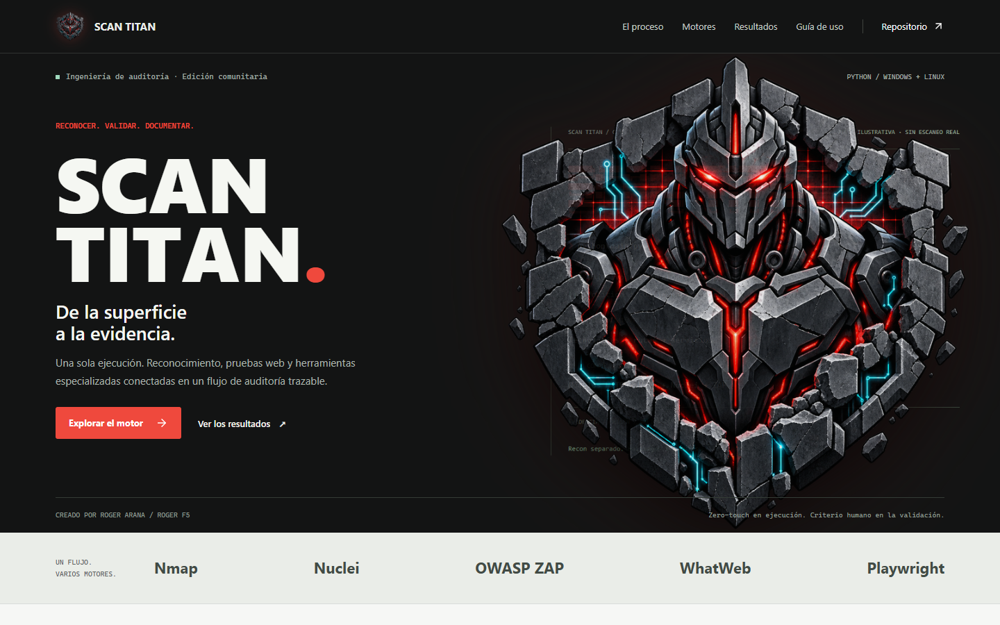

# Scan Titan

 [](LICENSE) [](https://github.com/RogerF5-Security/Scan-Titan/actions/workflows/validacion.yml)

Motor comunitario de auditoria automatizada en Python: reconocimiento, pruebas web, orquestacion de herramientas externas y reportes de vulnerabilidades para profesionales y equipos de seguridad de cualquier region.

**Version del motor:** 22.1.1. **Estado:** repositorio publico. [Web de Scan Titan](https://rogerf5-security.github.io/Scan-Titan/).



## Extension para Chrome

El ecosistema Scan Titan incluye una extension complementaria para Google Chrome, orientada a agilizar el reconocimiento y el flujo de evaluacion web desde el navegador.

[Instalar Scan Titan desde Chrome Web Store](https://chromewebstore.google.com/detail/scan-titan/epdbmbbfkmmhkfcfhlpncfkehgcaldcb)

## Inicio rapido

Requiere Python 3.11 o posterior. Clona este repositorio y ejecuta el instalador de tu plataforma dentro de la carpeta del proyecto.

Windows, PowerShell:

```powershell
git clone https://github.com/RogerF5-Security/Scan-Titan.git
cd Scan-Titan
python -m venv .venv
.\.venv\Scripts\Activate.ps1
powershell -ExecutionPolicy Bypass -File .\install\install.ps1
```

Linux:

```bash
git clone https://github.com/RogerF5-Security/Scan-Titan.git
cd Scan-Titan
python3 -m venv .venv
source .venv/bin/activate
bash install/install.sh
```

Agrega un objetivo por linea en `targets/targets.txt`, revisa `config/config.yaml` y ejecuta:

```text
python main.py --health-check
python main.py
```

La plantilla contiene ejemplos comentados. Una vez definidos los objetivos, el escaneo se ejecuta sin confirmaciones interactivas. El instalador puede requerir permisos del sistema; revisa sus avisos sobre herramientas faltantes.

El arranque omite los conteos de wordlists y el detalle de red, politica y ZAP. `--verbose-startup` los muestra a demanda. Los conteos corresponden a entradas reales, unicas y cargadas (hasta `max_wordlist_entries`); no se generan entradas para alcanzar un minimo artificial. XSS usa solo `wordlists/xss.txt`.

## Capacidades

- Reconocimiento de tecnologias, puertos, rutas, APIs y aplicaciones SPA.
- Integracion de Nmap, Nuclei, OWASP ZAP, WhatWeb, wafw00f, ffuf y subfinder cuando estan instalados.
- Modulos de auditoria HTTP, TLS, autenticacion, autorizacion e inyecciones.
- Telemetria aislada de CPU y RAM para Scan Titan y todos sus procesos hijos.
- Matriz Excel y lista raw de rutas HTTP `200/403` organizada por objetivo.
- Deduplicacion de hallazgos, comandos de validacion manual y evidencias de navegador.
- Dashboard diario e informe formal HTML con portada y detalle de hallazgos.

Los resultados requieren valorar su evidencia y confianza. Una prueba automatizada no garantiza encontrar todas las vulnerabilidades ni demostrar por si sola su explotabilidad.

**Uso autorizado:** ejecuta el motor solo contra activos incluidos en un alcance escrito y en entornos controlados. Ajusta concurrencia y perfiles al plan de auditoría.

## Comandos

| Comando | Funcion |
| --- | --- |
| `python main.py` | Ejecucion zero-touch |
| `python main.py --full` | Mayor cobertura y wordlists completas |
| `python main.py --verbose-startup` | Mostrar detalles de arranque y conteos reales cargados |
| `python main.py --monitor` | Monitor independiente |
| `python main.py --dashboard` | Regenerar dashboard con resultados existentes |
| `python main.py --health-check` | Comprobar estructura, dependencias y herramientas |
| `python main.py --help` | Opciones disponibles |

En Windows: `P` pausa, `R` reanuda, `F` finaliza y genera los reportes con lo encontrado; `Ctrl+C` interrumpe. Cada modulo, prueba HTTP y perfil externo tiene un timeout estricto. Un timeout se registra como salto, cancela los workers pendientes del componente y permite continuar el pipeline.

## Reportes

El lanzador incluido escribe por defecto en `audit_reports/`:

- `Daily_vulns_report.html`: dashboard de vulnerabilidades.
- `Formal_Audit_Report_Latest.html`: informe formal mas reciente.
- `Recon_Matrix.xlsx`: matriz de reconocimiento.
- `Recon_Matrix.xlsx`: incluye la lista raw de rutas que respondieron exclusivamente `200` o `403`.
- `External_Tools_Observability.html`: estado de herramientas externas.

Los archivos crudos de ZAP, wafw00f, Nuclei y Nmap se escriben en el directorio definido por `reporting.external_reports_dir`. La configuración pública usa `audit_reports/external reports`; una instalación puede sobrescribirla de forma automática mediante el archivo privado e ignorado por Git `config/config.local.yaml`.

Los reportes, sesiones y evidencias permanecen locales y estan excluidos de Git. El archivo versionado `targets/targets.txt` debe conservarse sin objetivos reales en los commits; `.gitignore` no oculta cambios de archivos que ya estan versionados.

## Documentacion y desarrollo

- [Manual completo](docs/README.md).
- [Presentacion web](docs/web/index.html): proceso, motores, resultados y guia de uso en espanol.
- [Web publica](https://rogerf5-security.github.io/Scan-Titan/) y [mantenimiento de GitHub Pages](docs/WEB_PUBLICA.md), desde este mismo repositorio.
- [Guia de publicacion comunitaria](docs/PUBLICACION.md).
- [Historial de versiones](CHANGELOG.md).
- [Licencia MIT](LICENSE).

```text
python -B -m unittest discover -s tests -v
```

Las comprobaciones de GitHub validan el paquete y sus pruebas en Windows y Linux. No ejecutan escaneos contra objetivos externos ni acreditan una instalacion completa de todos los motores.
